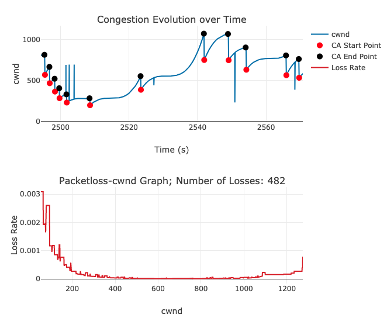

# ECON-Data
Data for the IMC'19 Paper -- ***ECON: Modeling the network to improve application performance***

- We do experiments under five different networks: **Azure, Southeast, Northeast, Long-distance, and Wireless**
- We test two TCP congestion control algorithms: **Reno and Cubic**
- For each network, we collect the `p-cwnd` function for all traces. 
- **data_x_y_z.csv** saves the `cwnd-lossrate` value pairs (**x**: No. parallel connections; **y**: Run index; **z**: TCP port number). 
- **data_x_y_z.html** provides a (interactive) visualization of 1) the p-cwnd function, and 2) how cwnd evolves over time.

